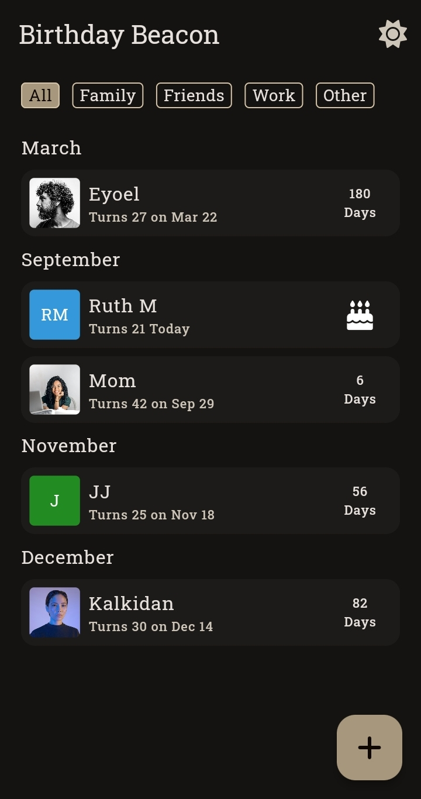
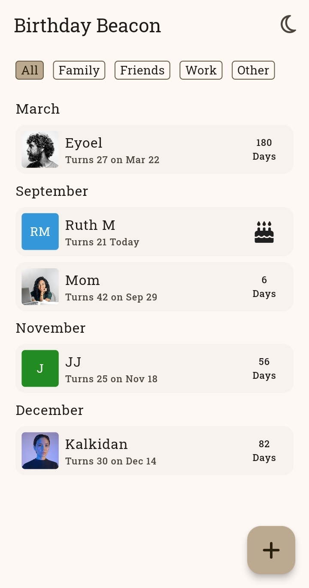
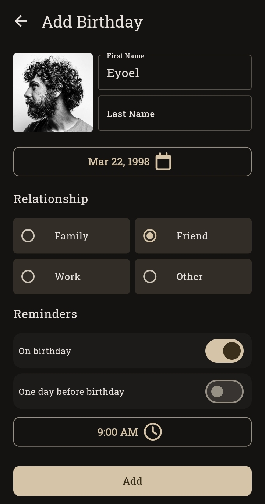
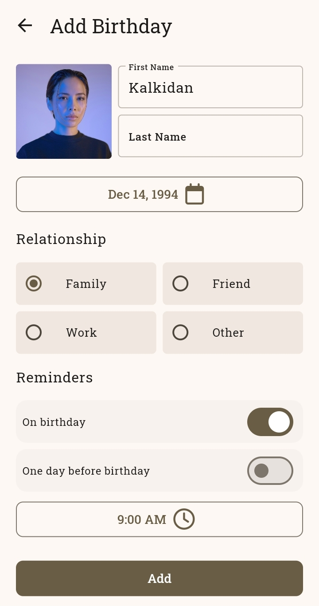

# Birthday Beacon

A birthday reminder app that helps users manage and remember important birthdays. The app allows users to add multiple reminders and customize their reminder preferences.

## Main Features

- **Comprehensive Birthday Management**: 
  - Easily add and organize multiple birthdays, allowing categorization by relationship type (family, friend, etc.).

- **Customizable Reminder**: 
  - Customize the time for reminders to suit your schedule..

- **User-Friendly UI with Light and Dark Mode**

## Technologies Used

- Flutter
- Riverpod for state management
- Sqflite for local SQLite storage
- Awesome Notifications for scheduling reminders

## Screenshots

| Dark                                         | Light                                        |
| ------------------------------------------   | ------------------------------------------   |
|   |   |
|   |   |